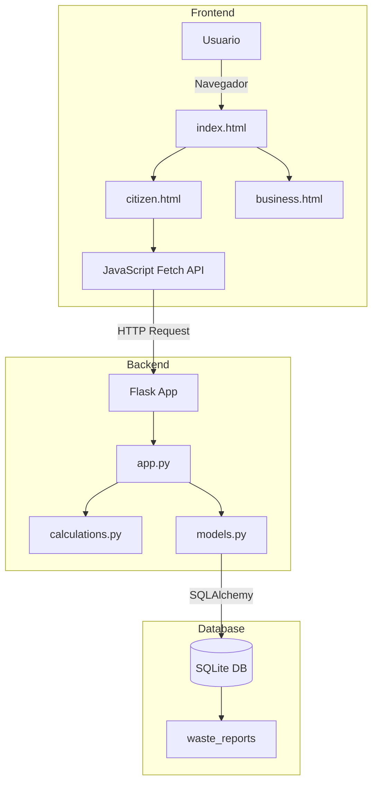

# EcoYvy - Technical Documentation

## 📋 Table of Contents
- [Overview](#overview)
- [System Architecture](#system-architecture)
- [Installation & Setup](#installation--setup)
- [Database Structure](#database-structure)
- [Calculation Logic](#calculation-logic)
- [API Endpoints](#api-endpoints)
- [Emission Factors & Sources](#emission-factors--sources)
- [Project Structure](#project-structure)
- [Roadmap](#roadmap)

---

## 🌿 Overview

**EcoYvy** is a web platform that gamifies recycling in Paraguay, allowing citizens and businesses to register waste, calculate their environmental impact (CO₂ avoided), and earn EcoPoints.

### Key Features:
- ✅ Waste registration with AI-based weight estimation
- ✅ CO₂ avoided calculation (LCA factors)
- ✅ Reward system (EcoPoints)
- ✅ MRV Validation (Measurement, Reporting, Verification)
- ✅ ESG Dashboard for businesses
- ✅ SQLite database for MVP

---

## ️ System Architecture
Frontend (HTML/Bootstrap) → Flask (Python) → SQLite Database
↓ ↓
JavaScript (Fetch API) calculations.py (ESG Logic)

### Tech Stack:
- **Backend:** Flask 3.0+ (Python)
- **Database:** SQLite + SQLAlchemy 3.1.1
- **Frontend:** HTML5 + Bootstrap 5 + JavaScript
- **Calculations:** Pure Python (LCA/IPCC formulas)

---

## 📥 Installation & Setup

### Prerequisites:
- Python 3.8 or higher
- pip (Python package manager)

### Steps:

1. **Clone the repository:**
   ```bash
   git clone https://github.com/adrianrmz11/EcoYvyApp.git
   cd EcoYvyApp
2. Install dependencies:
   ```bash
   pip install -r requirements.txt
3. Run the application:
   ```bash
   python app.py
4. Access:
  ```bash
Open your browser at: http://127.0.0.1:5000

Notes:
The database (ecoyvy.db) is automatically created in the instance/ folder.
Debug mode is enabled for development.
```
---

## 🧪 Testing

EcoYvy includes unit tests to verify that ESG/MRV calculations work correctly.

### Prerequisites

```bash
pip install pytest
```
### Run All Tests

```bash
pytest test_calculations.py -v
```

**What this does:**
- `-v` flag shows verbose output (each test name and result)
- Runs all tests in `test_calculations.py`
- Validates weight estimation, CO₂ calculations, and EcoPoints

### Expected Output
```bash
============================= test session starts =============================
platform win32 -- Python 3.x.x, pytest-x.x.x
test_calculations.py::TestWeightEstimation::test_pet_bottle_weight PASSED
test_calculations.py::TestWeightEstimation::test_glass_bottle_weight PASSED
test_calculations.py::TestCO2Calculation::test_co2_from_pet_weight PASSED
test_calculations.py::TestEcoPointsCalculation::test_ecopoints_without_mrv PASSED
test_calculations.py::TestEcoPointsCalculation::test_ecopoints_with_mrv PASSED
...
============================== X passed in 0.xx s =============================
```
### Test Coverage

The test suite validates:
- ✅ Weight estimation for all materials (PET, glass, aluminum, cardboard, etc.)
- ✅ CO₂ calculation formula (weight × 2.4)
- ✅ EcoPoints calculation (with and without MRV bonus)
- ✅ MATERIAL_META completeness
- ✅ Edge cases (zero quantity, large quantities)

### Add New Tests

To add tests for new functionality:
1. Create a new test function in `test_calculations.py`
2. Follow the naming convention: `test_[feature]_[expected_behavior]`
3. Use `assert` to validate expected results
4. Run tests to verify they pass

Example:
```python
def test_new_material_weight(self):
    """10 units of new material should weigh 0.50 kg"""
    result = estimate_weight("new_material", 10)
    assert result == 0.50
```
## 🗄️ Database Structure
### Table: `waste_reports`

| Field | Type | Description |
|-------|------|-------------|
| `id` | Integer | Unique report ID (primary key) |
| `material` | String(50) | Material type (pet, glass, can, etc.) |
| `quantity` | Integer | Number of reported units |
| `weight_kg` | Float | Estimated weight in kg |
| `co2_saved_kg` | Float | CO₂ avoided in kg |
| `eco_points` | Integer | Points earned |
| `mrv_verified` | Boolean | If data is verified (+25% points) |
| `confidence` | Float | Estimation confidence (0-1) |
| `timestamp` | DateTime | Date and time of the report |

### Relation to `calculations.py`:
Values are automatically calculated when a report is created via `/api/analyze`.

---

## 🧮 Calculation Logic

### 1. Weight Estimation
**Formula:** `unit_weight × quantity`

**Weights per unit (kg):**
- PET (500ml): 0.030 kg
- Glass (330ml): 0.350 kg
- Aluminum can: 0.015 kg
- Cardboard (small box): 0.200 kg
- Generic plastic: 0.050 kg
- Electronics: 0.300 kg
- Organic: 0.500 kg

### 2. CO₂ Avoided Calculation
**Formula:** `weight_kg × 2.4`

**Source:** IPCC emission factor for recycled vs. virgin plastic (2.4 kg CO₂/kg).

### 3. EcoPoints
**Base Formula:** `weight_kg × 100`

**MRV Bonus:** If `mrv_verified = True`, a ×1.25 multiplier is applied.

**Example:**
- 0.15 kg PET → 15 base points
- With MRV → 18.75 points (rounded: 18)

### 4. Tree Equivalent
**Formula:** `co2_kg / 21.77`

**Source:** IPCC - One tree absorbs ~21.77 kg CO₂/year.

---

## 🔌 API Endpoints

### `POST /api/analyze`
**Description:** Analyzes a waste item and calculates metrics.

**Request (FormData):**
material: "pet"
item_count: 5
photo: <image file>


**Response (JSON):**
```json
{
  "material": "pet",
  "label": "PET Bottle",
  "icon": "🧴",
  "item_count": 5,
  "weight_kg": 0.15,
  "co2_saved_kg": 0.36,
  "co2_margin": 0.3,
  "ecopoints": 18,
  "mrv_verified": true,
  "confidence": 0.93,
  "trees_saved": 0,
  "location": "Paraguay River, Zone 4"
}
```
GET /citizen
Description: Main page for citizens.
GET /business
Description: ESG Dashboard for businesses.
Calculated Metrics:
Total weight (kg)
CO₂ avoided
Total EcoPoints
Estimated income ($0.45/kg)
ESG Seal Level (1-5)

🌍 Emission Factors & Sources
| Material |	CO₂ Factor (kg/kg) |	Source |
|----------|---------------------|---------|
| Plastic (PET) |	2.4	IPCC | Recycled vs. Virgin |
| Aluminum	| 2.4	| Generalized (conservative estimate) |
| Glass |	2.4 |	Generalized |
|Cardboard |	2.4 |	Generalized |
| Paper |	2.4 |	Generalized |

Note: For the MVP, a generalized factor of 2.4 kg CO₂/kg is used. In Phase 2, specific factors per material will be implemented.

Project Structure
```
EcoYvyApp/
├── app.py                    # Flask app + main routes
├── calculations.py           # ESG/MRV calculation logic
├── models.py                 # SQLAlchemy models (DB)
├── requirements.txt          # Python dependencies
├── TECHNICAL_DOCS.md         # This file
│
├── instance/
│   └── ecoyvy.db            # SQLite database
│
├── static/
│   ├── css/                 # CSS styles
│   └── js/                  # JavaScript (frontend)
│
├── templates/
│   ├── index.html           # Landing page
│   ├── citizen.html         # Citizen view
│   └── business.html        # Business view
│
└── ecoyvy_mvp_resources/
    └── logic/
        ── calculator.py    # Original calculation version
```
🗺️ Roadmap
- Phase 1 (MVP - Current)
- ✅ Functional database
- ✅ ESG/MRV calculations implemented
- Complete frontend-backend connection
- ⏳ Report persistence

Phase 2 (Automation)
- Integration with ActivePieces/n8n
- Webhooks for notifications
- Automatic weekly reports
- Google Sheets synchronization

Phase 3 (Scaling)
- Migration to PostgreSQL
- User authentication
- Real-time dashboard
- Public documented API

---


**Fijate que:**
1. Después del `end` final del diagrama, hay **tres comillas invertidas solas** en una línea
2. Después de eso, una línea vacía
3. Después, `---` (línea divisoria)
4. Después, `## 👥 Team`

---

### 📝 CÓMO ARREGLARLO:


## System Architecture Diagram



👥 Team
- Backend & ESG Logic: Jesfer88 (Yisus)
- Frontend & UI/UX: Guillermo Martínez (adrianrmz11)
- Vision & Product: EcoYvy Team

📄 License
- Educational Project - EcoYvy Paraguay 2026
- Last updated: June 2026
